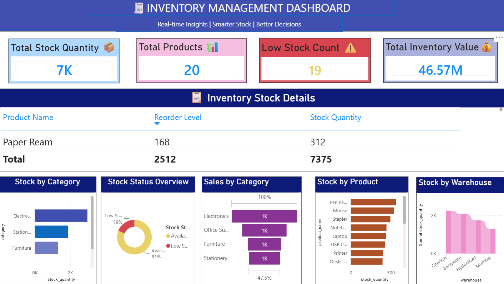

# 📦 Inventory Management Dashboard

## 📊 Project Overview

This project analyzes inventory data using PostgreSQL and Power BI to provide insights into stock levels, inventory value, sales, products, suppliers, categories, and warehouses.

## 🛠️ Tools Used

- PostgreSQL
- pgAdmin 4
- SQL
- Microsoft Power BI

## 🔍 SQL Analysis

The SQL analysis includes:

- Total stock quantity
- Low-stock products
- Total inventory value
- Inventory value by category
- Stock by warehouse
- Top 10 products by inventory value
- Inventory value by warehouse
- Inventory value by supplier
- Sales by category

## 📈 Power BI Dashboard

The dashboard provides:

- Total Stock Quantity
- Total Products
- Low Stock Count
- Total Inventory Value
- Inventory Stock Details
- Stock by Category
- Stock Status Overview
- Sales by Category
- Stock by Product
- Stock by Warehouse

## 📷 Dashboard Preview

## 📁 Project Files

- `Inventory_Analysis_SQL.sql` — SQL table creation and analysis queries
- `Inventory_Analysis_Dashboard.pbix` — Power BI dashboard
- `inventory-dashboard.png` — Dashboard preview

## 🎯 Project Objective

The goal of this project is to transform inventory data into meaningful business insights that can support better stock management and decision-making.
